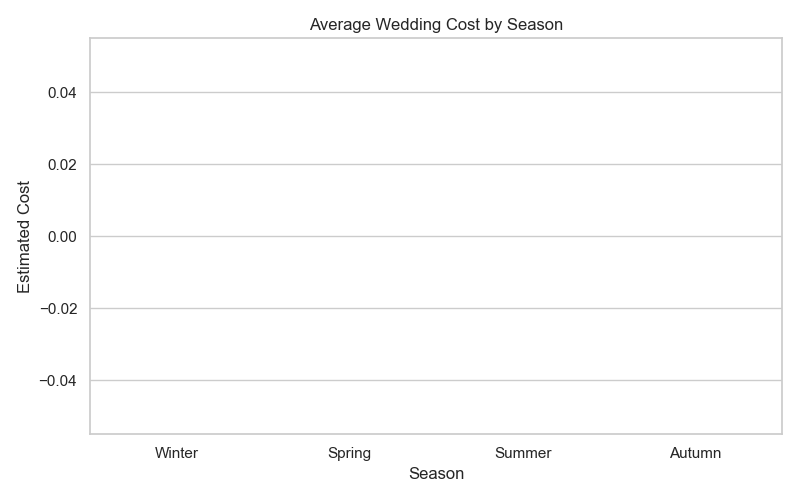

<h1 align="center">💍 Wedding Crunchers Analysis 📊</h1>

<p align="center">
  An in-depth data analysis project exploring wedding-related datasets to uncover trends, patterns, and actionable insights.  
  <br/>
  <em>From guest lists to budget breakdowns — this analysis tells the full wedding story.</em>
</p>

---

## 📸 Project Overview
This project analyzes wedding-related datasets to answer key questions like:
- How do wedding budgets vary by location and season?
- Which wedding expenses take up the largest share?
- How do guest counts impact costs?
- Which trends are becoming popular in recent weddings?

---

## 🚀 Features & Insights
- 📊 **Data Cleaning & Preparation** (removing duplicates, handling missing values)
- 📈 **Exploratory Data Analysis** with visualizations
- 🎯 Key insights on **budget distribution**, **popular wedding months**, and **category-wise expenses**
- 📉 Correlation analysis between budget and guest count
- 📑 Well-documented Jupyter Notebook for reproducibility

---

## 🛠 Tools & Libraries
- **Language:** Python
- **Libraries:** Pandas, NumPy, Matplotlib, Seaborn
- **Environment:** Jupyter Notebook

---

## 📂 Project Structure

📦 wedding-crunchers-analysis
┣ 📂 data # Raw and cleaned datasets
┣ 📂 notebooks # Jupyter notebooks with full analysis
┣ 📂 visuals # Graphs and charts
┗ README.md # Project documentation


---

## 📦 Installation & Usage
```bash
# Clone the repository
git clone https://github.com/your-username/wedding-crunchers-analysis.git

# Navigate to project folder
cd wedding-crunchers-analysis

# Open Jupyter Notebook
jupyter notebook analysis.ipynb

📊 Sample Visuals
<p align="center">  <br/> <em>Example: Wedding Budget Distribution</em> </p>
📌 Roadmap
 Data cleaning & preprocessing

 EDA & visualizations

 Predictive modeling for budget estimation

 Interactive dashboard

🤝 Contributing
Contributions are welcome!

Fork this repository

Create your feature branch (git checkout -b feature-name)

Commit your changes (git commit -m 'Add feature')

Push to branch (git push origin feature-name)

Open a Pull Request

📜 License
This project is licensed under the MIT License.
